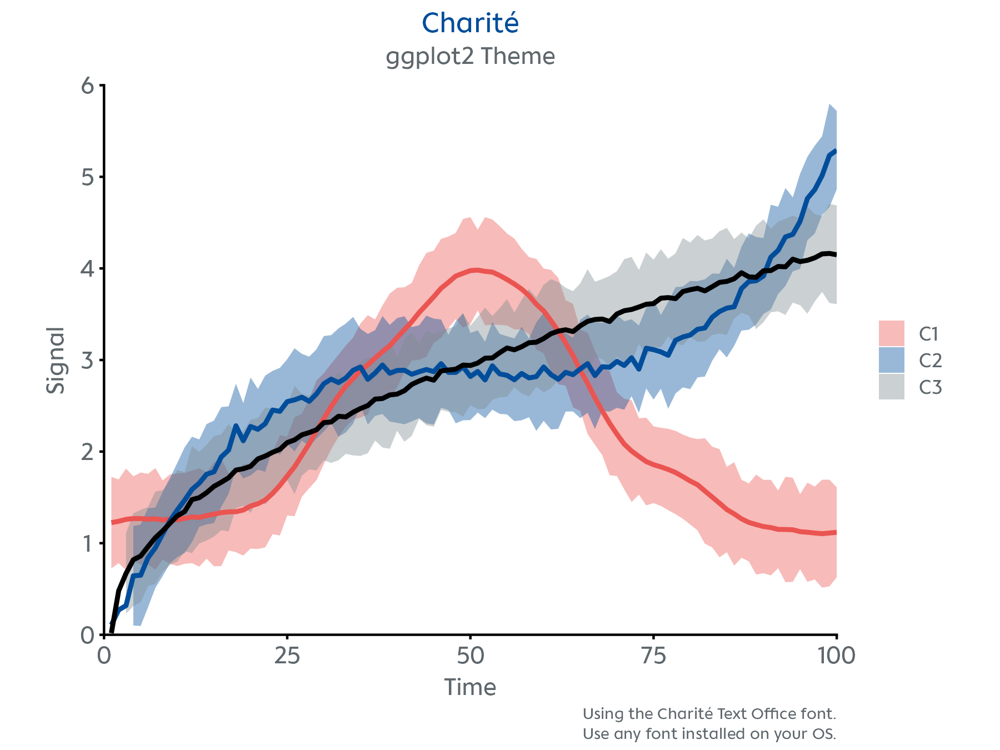
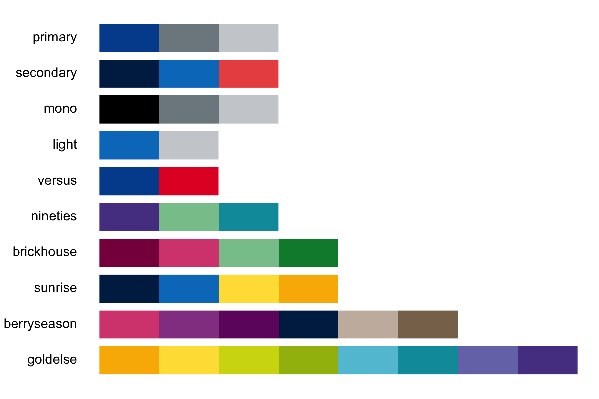

<!-- README.md is generated from README.Rmd. Please edit that file -->

```{r, include = FALSE}
knitr::opts_chunk$set(
  collapse = TRUE,
  comment = "#>",
  fig.path = "man/figures/README-",
  dpi = 300,
  dev = "ragg_png",
  out.width = "80%"
)
```

# charite

<!-- badges: start -->
<!-- badges: end -->


A minimal R package with a Charité-styled `ggplot2` theme, [visual identity](https://marke.charite.de/d/Y3FxSwD6Tz3a) colour palettes, and publication-ready figure export for manuscripts and slides.

## Installation

You can install the development version of `charite` from [GitHub](https://github.com/johannesjuliusm/charite) with:

``` r
# install.packages("devtools")
devtools::install_github("johannesjuliusm/charite")
```

To install the package on a machine with proxies, e.g., the standard Windows PC in the Charité network, find more detailed install instructions in the [installation vignette](https://github.com/johannesjuliusm/charite/blob/main/doc/install_the_package.html).

## Examples

Visualize time series data with `theme_charite()`.

<p align="center">
  
</p>

Preview the available colour palettes.

<p align="center">
  
</p>

## Workflow

```r
# create your ggplot
p <- ggplot(data, aes(x = x, y = y)) +
        geom_point(size = 3, color = charite_colors$HIMBEER) # use any of the Charité colors
        
# format the plot style
p <- p + theme_charite()

# easily save your plot in a format optimized for slides and publications
nice_save("myfigure.png", p)
```

## Available Functions

- `theme_charite()` – A custom ggplot2 theme
- `charite_colors` – Named list of hex codes of the Charité visual identity colours
- `charite_palettes` – Named list of colour palettes derived from the Charité visual identity colour scheme
- `preview_charite_palettes()` – Shows the available colour palettes as colour swatches
- `nice_save()` – ggsave wrapper with defaults ideal for high-res figures for publication
- `scale_color_charite()` – ggplot2 colour scale using palettes from `charite_palettes`
- `scale_fill_charite()` – ggplot2 fill scale using palettes from `charite_palettes`
- `example_plot()` – Generates a demo plot
- `make_charite_palette()` – Internal function to interpolate or reverse colour palettes
- `virchow()` – Surprise console ASCII art. Use for fun
- `curves` – Included dataset with time series curves for demo plot

## Author

Developed by **Johannes Julius Mohn**  
[Max Planck School of Cognition](https://cognition.maxplanckschools.org/en/doctoral-candidates/johannes-j-mohn) & [Charité – Universitätsmedizin Berlin](https://medpsych.charite.de/en/metas/person/person/address_detail/msc_johannes_mohn)

Report bugs [here](https://github.com/johannesjuliusm/charite/issues).

Get in touch via [johannes.mohn@charite.de](mailto:johannes.mohn@charite.de)

## How to Acknowledge

If you use this package in your work or publication, please acknowledge the author.  
*Example*: "The figures were generated using a custom theme from the `charite` R package by Johannes Julius Mohn."