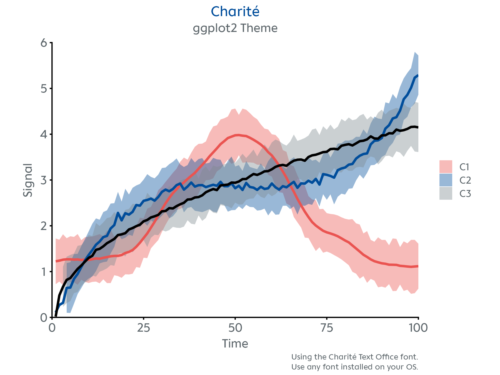
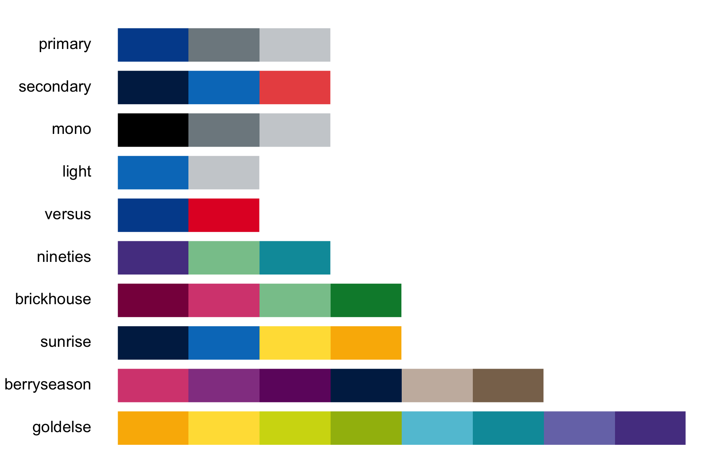

<!-- README.md is generated from README.Rmd. Please edit that file -->

# charite

<!-- badges: start -->
<!-- badges: end -->


A minimal R package with a Charité-styled `ggplot2` theme, [visual
identity](https://marke.charite.de/d/Y3FxSwD6Tz3a) colour palettes, and
publication-ready figure export for manuscripts and slides.

## Installation

You can install the `charite` package from
[GitHub](https://github.com/johannesjuliusm/charite) with:

``` r
# install.packages("devtools")
devtools::install_github("johannesjuliusm/charite")
```

To install the package on a machine with proxies, e.g., the standard
Windows PC in the Charité network, find more detailed installation
instructions in the [installation
vignette](https://johannesjuliusm.github.io/charite/articles/install_the_package.html).

## Examples

Visualize your data with `theme_charite()` to match the corporate style.

<p align="center">

</p>

Preview the available colour palettes.

<p align="center">

</p>

## Workflow

``` r
# create your ggplot2 figure
p <- ggplot(data, aes(x = x, y = y)) +
        geom_point(size = 3, color = charite_colors$HIMBEER) # use any of the Charité colors
        
# format the plot style
p <- p + theme_charite()

# alternatively, customize the plot style further
# for example by specifying a font
p <- p + theme_charite(font = "Charité Text Office")

# easily save your plot in a format optimized for slides and publications
nice_save("myfigure.png", p, layout = "slides")
```

## Available Functions

- `theme_charite()` – A custom ggplot2 theme
- `charite_colors` – Named list of hex codes of the Charité colours
- `charite_palettes` – Named list of colour palettes derived from the
  Charité visual identity
- `preview_charite_palettes()` – Shows the available colour palettes
- `nice_save()` – wrapper of `ggplot2::ggsave()` for high-res
  publication-ready figures
- `scale_color_charite()` – ggplot2 colour scale using the
  `charite_palettes`
- `scale_fill_charite()` – ggplot2 fill scale using the
  `charite_palettes`
- `example_plot()` – A demo plot
- `make_charite_palette()` – Internal function to interpolate or reverse
  colour palettes
- `virchow()` – Surprise ASCII art. Use for fun
- `curves` – Included dataset for demo plot

## How to cite

If you use the `charite` R package in your work, please cite:

``` bibtex
@software{mohn2026charite,
  author    = {Mohn, Johannes Julius},
  title     = {charite: Charité-styled publication-ready visualization in R},
  year      = {2026},
  version   = {0.5.1},
  url       = {https://github.com/johannesjuliusm/charite},
  license   = {MIT}
}
```

## License

MIT © 2026 Johannes Julius Mohn

Report bugs [here](https://github.com/johannesjuliusm/charite/issues).

## Acknowledgements

Developed by **Johannes Julius Mohn** ([Max Planck School of
Cognition](https://cognition.maxplanckschools.org/en/doctoral-candidates/johannes-j-mohn)
& [Charité – Universitätsmedizin Berlin](https://www.charite.de/))  
Get in touch via <johannes.j.mohn@maxplanckschools.de>

The hex logo was designed by **Valentina Nercolini**.  
`charite` is now also available as a [python
package](https://github.com/pedRamezani/charite-plot) developed by
**Pedram Ramezani**.
